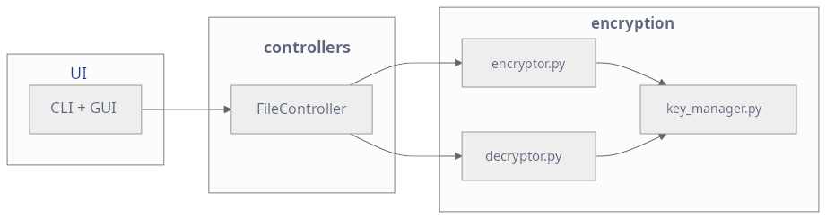

# Arkkitehtuurikuvaus

Sovellus noudattaa kolmitasoista kerrosarkkitehtuuria, jossa käyttöliittymä, sovelluslogiikka ja salauslogiikka on erotettu toisistaan. Tämä tekee mielestäni rakenteesta selkeän, testattavan ja helposti laajennettavan.

### Kerrosten vastuut

- **UI (CLI + GUI)**
  Vastaa käyttäjän syötteistä, tiedostodialogeista ja viestien näyttämisestä.
  UI ei sisällä sovelluslogiikkaa tai salauskoodia.

- **controllers/**
  `FileController` toimii keskikerroksena ja hoitaa sovelluslogiikan:
  - kutsuu `Encryptor`- ja `Decryptor`-luokkia
  - käsittelee virheet
  - pyytää käyttäjältä luvan alkuperäisen tiedoston poistoon
  - palauttaa tilaviestit käyttöliittymälle

- **encryption/**
  Sisältää kryptografian:
  - `key_manager.py` – avaimen luonti PBKDF2-menetelmällä
  - `encryptor.py` – tiedoston salaus
  - `decryptor.py` – salauksen purku

---

## Sekvenssikaavio: tiedoston salaaminen

Alla oleva sekvenssikaavio kuvaa salausprosessin kulun.
UI kutsuu `FileController.encrypt()`, joka käynnistää salauksen `Encryptor`-luokan kautta.

---

## Testaus

Testit kohdistuvat erityisesti:

- `encryptor.py`
- `decryptor.py`
- `key_manager.py`

---

## Yhteenveto

- Arkkitehtuuri on kolmitasoinen: **UI → Controller → Encryption**.
- Salauslogiikka on eristetty ja testattava.
- `FileController` yhdistää selkeästi käyttöliittymän ja encryption-kerroksen.
